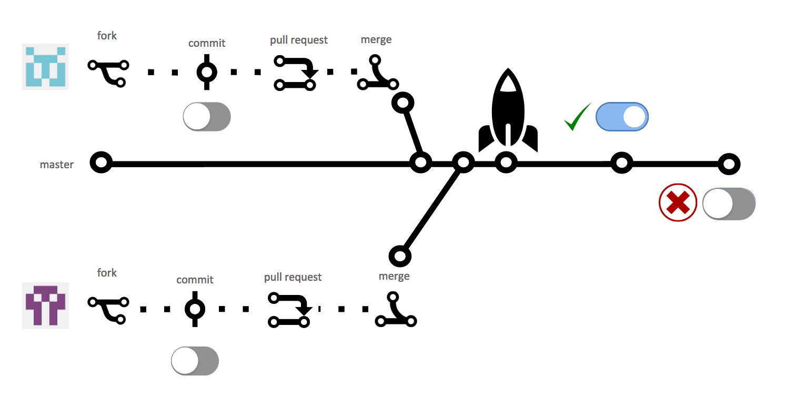
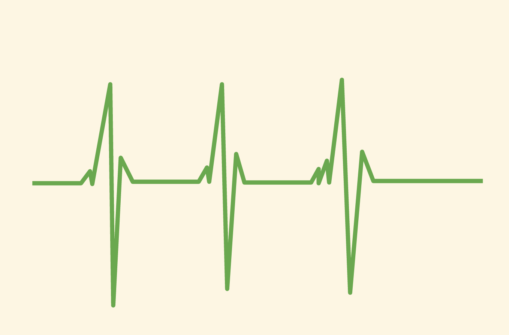
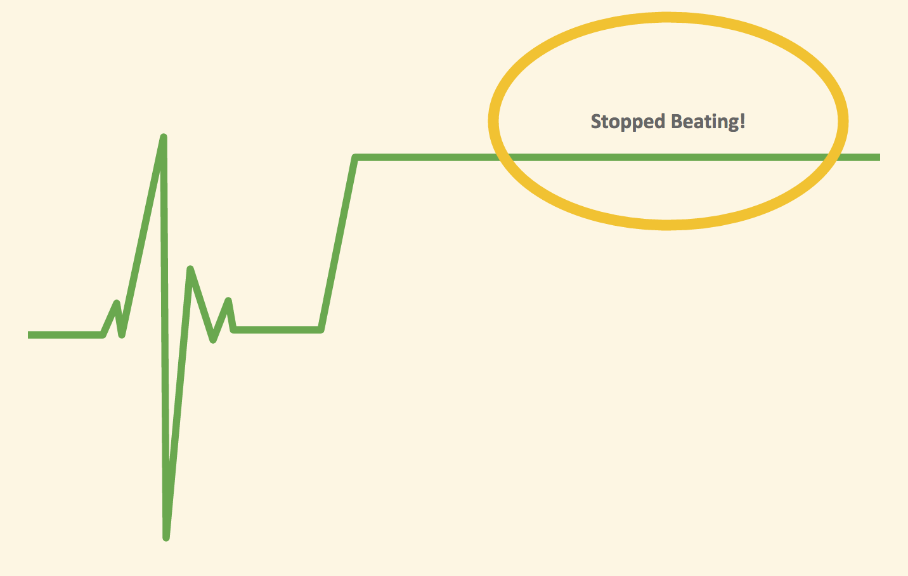

Feature Toggles
===============

<p align="center">
  
  
  
</p>

Example of using feature techniques at Application level, so here we'll focus
more on the category of [Release
toggles](https://martinfowler.com/articles/feature-toggles.html#ReleaseToggles).

## The process of toggling

In order to make every commit production ready, feature toggle is one of the
techniques that allow in-progress features to be checked in while still allowing
that codebase to be deployed to production at any time. It also means that we're
separating **release** from **deploy**.


_feature toggle during the release process_

Step-by-step:

* Toggle **OFF**, then commit/push your changes
* Release it, test it (e.g.: different environments, limit range of users)
* Then set the toggle to **ON**
* If you notice a critical bug or some unexpected behaviour, instead of
  a rollback or reverting all the changes, consider a rollforward, turn the feature off
  and take your time to fix it.
* Once you are happy with your feature in place, remember to **recycle** the toggle.

The usage of feature toggle requires a lot of discipline and must be used
carefully. You might end up with toggles of toggles or you could be in a
situation where you just don’t know where else that toggle has being used, so
you’ll never completely delete it. Be mindful that you can work without it, using
different techniques like [Branch by
Abstraction](https://medium.com/r/?url=https%3A%2F%2Fmartinfowler.com%2Fbliki%2FBranchByAbstraction.html)
that enables you gradually make changes in a total decoupled code which also have
the benefit of separation of concerns, making easy to maintain.

### The example of heart monitor

This repository uses as an example the heart monitor, which is a quite simple way
to describe a few new requirements in order to simulate how would we apply
feature toggling at the application level. It's organized by branches, so
the [master branch](https://github.com/Pragmateam/feature-toggles) will contain
the final state and you can travel in time through the branches
[feature#1](https://github.com/Pragmateam/feature-toggles/tree/feature%231),
[feature#2](https://github.com/Pragmateam/feature-toggles/tree/feature%232) and so on.
You can also keep track of the feature toggling journey through the
[commits](https://github.com/Pragmateam/feature-toggles/commits/master).

You can learn more details about how [cardiac monitoring
works](https://en.wikipedia.org/wiki/Cardiac_monitoring) but on this example
we'll over simplify what it is. Imagine that our software collects signals over
time, and every minute the machine sends a signal value that our software will
evaluate and plot on a chart, like on the image below:


_heart monitor example_

### [Feature #1 - Heart beating status](https://github.com/Pragmateam/feature-toggles/tree/feature%231)

- Given a collection of cardiac pulses as signals are available
- When the monitor evaluates a certain amount of time series data
- Then it should send a message indicating whether the heart has stopped or is still beating

Example:

1. If the line is flat (all signals remains 0), the status should indicate that the heart has stopped.
2. If all signals varies with higher/lower values the status should indicate that the heart is still beating.

This code is also available on the branch [feature#1](https://github.com/Pragmateam/feature-toggles/tree/feature%231).

### [Feature #2 - Heart beating status](https://github.com/Pragmateam/feature-toggles/tree/feature%232)

- Given a collection of cardiac pulses as signals are available
- When the monitor evaluates a certain amount of time series data
- And all signals remains the same
- Then the heart beating status should be **stopped**

Example:

1. If the line is flat (all signals remains the same), the status should indicate that the heart has stopped.
2. If all signals varies with higher/lower values the status should indicate that the heart is still beating.


_heart monitor example_

This code is also available on the branch [feature#2](https://github.com/Pragmateam/feature-toggles/tree/feature%232)
and the pull request can also be followed through [here](https://github.com/Pragmateam/feature-toggles/pull/1).

### Reclycling feature #2 once it's done

The feature toggle was removed on branch [recycling-feature#2](https://github.com/Pragmateam/feature-toggles/tree/recycling-feature%232)
and the pull request can also be followed through [here](https://github.com/Pragmateam/feature-toggles/pull/2)

The following features will be described here in the future.

### Next steps

* Describe new features
* Add new code that satisfies the new requirements using feature toggles
  * Use different branches to illustrate what it would look like in a real scenario.

## Setup

Install [node.js](https://nodejs.org/en/download/current/). At this moment,
we're using `v7.6.0`.

Install the dependencies:

```
$ npm install
```

## Running the tests

```
$ npm test
```

## References

* [Continuous Delivery Book](https://www.amazon.com/dp/0321601912?tag=contindelive-20)
* [Release it Book](https://pragprog.com/book/mnee/release-it)
* [Feature Toggles by Martin Fowler](https://martinfowler.com/articles/feature-toggles.html)
* [Branch by Abstraction by Martin Fowler](https://martinfowler.com/bliki/BranchByAbstraction.html)

## License
Pragmateam/feature-toggles is released under the [MIT
License](http://www.opensource.org/licenses/MIT).
