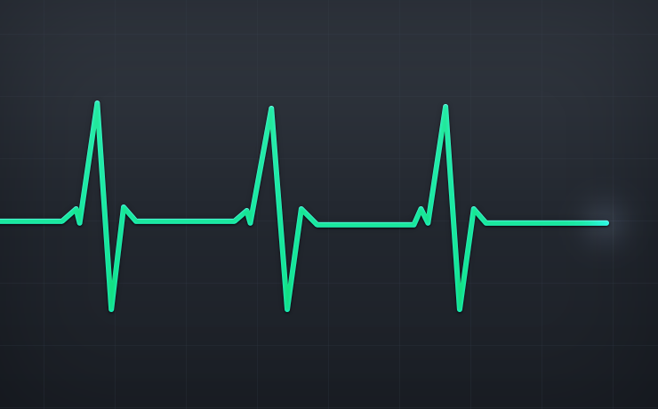

Feature Toggles
===============

Example of using feature techniques at Application level, so here we'll focus
more on the category of [Release
toggles](https://martinfowler.com/articles/feature-toggles.html#ReleaseToggles).

## The process of toggling:

In order to make every commit production ready, feature toggle is one of the
techniques that allow in-progress features to be checked in while still allows
that codebase to be deployed to production at any time. It also means that we're
separating **release** from **deploy**.


_feature toggle during the release process_

Step-by-step:

* Toggle **OFF**, start to commit/push your changes
* Release it, test it (e.g.: different environments, limit range of users)
* Then you can toggle **ON**
* If you noticed a critical bug or some unexpected behaviour, instead of
  rollback or revert all the things, just turn it off and take a breath.
* Once you are happy with your feature in place, remeber to recycle the toggle.
Remove your feature toggle code (both test and production code)

### The example of heart monitor

This repository use as an example the heart monitor, which is a quite simple way
to describe a few new requirements in order to simulate how would we apply
feature toggling at the application level.

You can learn with more details how [cardiac monitoring
works](https://en.wikipedia.org/wiki/Cardiac_monitoring) but on this example
we'll over simplify what it is. Imagine that our software collects signals over
time, and every minute the machine sends a signal value that our software will
evaluate it and plot a chart, like on the image below:


_heart monitor example_

### Feature #1 - Heart beating status
Given a collection of cardiac pulses as signals are available
When the monitor evaluates certain amount of time series data
Then it should send a message weather the heart has stopped or it's still beating.

1. If the line is flat (all signals remains 0), the status will indicate that the heart has stopped.
2. If all signals varies with higher/lower values the status will indicate that the heart is still beating.

The following features will be described here in the future.

### Next steps:

* Describe new features
* Add new code that satisfies the new requirements using feature toggles
  * Maybe we'll use different branches to ilustrate how ir would be in a real
    scenario.

## Setup:

Install [node.js](https://nodejs.org/en/download/current/). At this moment,
we're using `v7.6.0`.

Install the dependencies:

```
$ npm install
```

## Running the tests:

```
$ npm test
```
